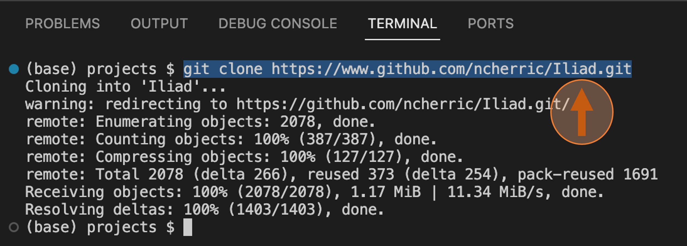

.. _link: https://github.com/ncherric/Iliad

.. _getting_started/demo:

====
DEMO
====
########################

The purpose of the DEMO is to take you step-by-step in retrieving the *Iliad* suite of workflows and running the Main Module using tutorial data.

Cloning the GitHub Repo
=======================

* Step 1. Open up your web browser and follow this link_ to *Iliad* GitHub repository. You can read the README for general info and copy the HTTPS link. Here is the `HTTPS link <https://www.github.com/ncherric/Iliad.git>`_  to save you some web browsing.

.. toctree::
   :maxdepth: 2

* Step 2. Open the UBUNTU app and create a username and pw

.. toctree::
   :maxdepth: 2

* Step 3.

   .. image:: img/Git-step3.png
   :align: center
   :width: 400

.. toctree::
   :maxdepth: 2

* Step 4.

   .. image:: img/Git-step4.png
   :align: center
   :width: 400

.. toctree::
   :maxdepth: 2

* Step 5.

   .. image:: img/Git-step5.png
   :align: center
   :width: 400

.. toctree::
   :maxdepth: 2

* Step 6.

   .. image:: img/Git-step6.png
   :align: center
   :width: 400

.. toctree::
   :maxdepth: 2

* Step 7.

   .. image:: img/Git-step7A.png
   :align: center
   :width: 400

.. toctree::
   :maxdepth: 2

   .. image:: img/Git-step7B.png
   :align: center
   :width: 400

.. toctree::
   :maxdepth: 2

* Step 8.

   .. image:: img/Git-step8A.png
   :align: center
   :width: 400

.. toctree::
   :maxdepth: 2

   .. image:: img/Git-step8B.png
   :align: center
   :width: 400

.. toctree::
   :maxdepth: 2

* Step 9.

   .. image:: img/Git-step9A.png
   :align: center
   :width: 400

.. toctree::
   :maxdepth: 2

   .. image:: img/Git-step9B.png
   :align: center
   :width: 400

.. toctree::
   :maxdepth: 2

* Step 10.

   .. image:: img/Git-step10.png
   :align: center
   :width: 400

.. toctree::
   :maxdepth: 2

* Step 11.

   .. image:: img/Git-step11A.png
   :align: center
   :width: 400

.. toctree::
   :maxdepth: 2

   .. image:: img/Git-step11B.png
   :align: center
   :width: 400

.. toctree::
   :maxdepth: 2

