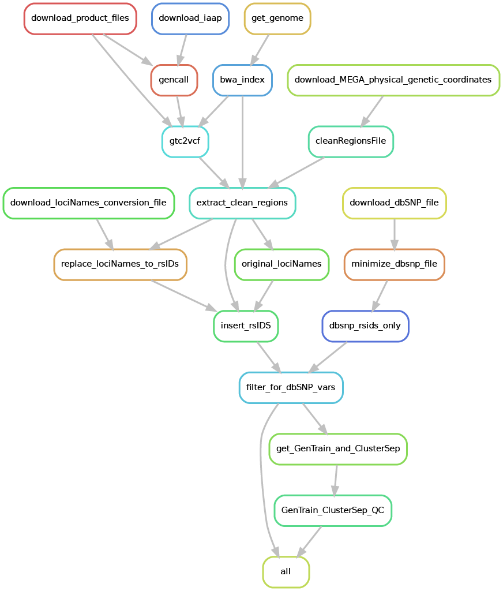

.. _tutorial/liftover:

==============================
Lift Over Variants - 37 / 38
==============================

.. hyperlinks
.. _Iliad: https://iliad-readthedocs.readthedocs.io/en/latest/index.html
.. _Snakemake: https://snakemake.readthedocs.io
.. _Illumina: https://support.illumina.com/
.. _merge: https://iliad-readthedocs.readthedocs.io/en/latest/tutorial/merge_ref_target.html

.. _MEGA: https://support.illumina.com/array/array_kits/infinium-multi-ethnic-global-8-kit.html
.. _GCP: https://cloud.google.com/
.. _iaap-cli: https://support.illumina.com/downloads/iaap-genotyping-cli.html
.. _EULA: chrome-extension://efaidnbmnnnibpcajpcglclefindmkaj/https://support.illumina.com/content/dam/illumina-support/documents/downloads/software/iaap/Illumina%20Array%20Analysis%20Platform%20IAAP%201.1%20EULA.pdf
.. _gtc2vcf: https://github.com/freeseek/gtc2vcf
.. _bcftools: https://samtools.github.io/bcftools/bcftools.html
.. _installation: https://iliad-readthedocs.readthedocs.io/en/latest/getting_started/installation.html
.. _module: raw sequence read module here
.. _slides: https://slides.com/johanneskoester/snakemake-tutorial

This tutorial introduces the reference assembly version liftover `submodule` of the Iliad_ workflow developed using Snakemake workflow language.
Please visit Snakemake_ for specific details. In general, though, each module is composed of rules. These rules define how output files are generated from input files while 
automatically determining dependencies amongst the rules. A ``DAG`` (directed acyclic graph) of jobs will be built each time to account for all of the samples and jobs 
that will executed either via job scheduler or local cores and will execute in parallel if multiple jobs are declared.
Because of the Snakemake workflow system design, the **Iliad** workflow is scalable from single core machines to HPC clusters with job schedulers.

The **Liftover submodule** is designed to re-designate genomic positions of a data file to the correct reference assembly genome (e.g. switching POS field in a VCF).
Iliad is currently limited to switching `Homo sapiens` GRCh37 to GRCh38 and vice versa.
We ensured no bioinformatics knowledge is needed to run this module with the help of external test runs performed on Google Cloud Platform (GCP_).

**Liftover GRCh37 to GRCh38 Module DAG**

.. toctree::
   :maxdepth: 2

Background
==========

Genetics research continues at an unprecedented speed and new reference genome assemblies encourage the use of updated positions when combining old data with new data.
To make a comprehensive genomic pipeline, 
we wanted to provide the means necessary for researchers to still access such a large body of data that remains important for many analyses. 
Sometimes you just need to switch the position sites in your VCF files so you can properly merge your data with others.

This module is currently limited to switching `Homo sapiens` GRCh37 to GRCh38 and vice versa.
It is configured to those reference assembly **dbSNP annotation files**, meaning download file locations stated in `config.yaml` are provided only for GRCh37 and GRCh38. GRCh38 is the default.
It does possess the capability to be adapted to other reference assemblies and species. Pull requests and collobarations are welcomed.

Basics
======

This is a minor submodule in terms of being lightweight and does not require many of the components that some of the other modules do.
This module does not require Singularity.

Genetic data compatibility is very important for analyses that involve multiple datasets so switching or updating positions will allow you to merge_ them. 
Or, if you would like to just update your data and have the latest positions, this submodule can do so for you.

The indicated dbSNP annotation file in the ``config/config.yaml`` will be automatically downloaded and used to create a guide file that is used to swap out current sites for desired sites.
Your ``vcf`` will have to be annotated and have correct rsID tags.

Default workflow configurations can be found in your path to the configuration file: ``config/config.yaml``.

Setup
=====

For this module, you can **SKIP STEP 2** Installation_ of Iliad.
You will find your new working directory within the ``path/to/project-workdir/Iliad/`` folder.
Make sure your current working directory is in this cloned repo as stated in the installation.
ALSO, be sure your ``workdirPath: /path/to/project-workdir/Iliad/`` in the ``config/config.yaml`` is set accordingly and with a forward slash ``/`` at the end.

.. code-block:: console

   $ cd Iliad

In that working directory you will find there are a number of directories with files and code to run each of the module pipelines.

**FIRST**, there is a ``data/liftover/`` directory with a ``readme.md`` file. You must place your ``.vcf`` file in this folder.

**SECOND**, there is a configuration file with some default parameters, however, you MUST at least change the ``workdirPath`` parameter to the appropriate 
path leading up to and including ``/Iliad/`` e.g. ``/path/to/project-workdir/Iliad/``. The configuration file is found in ``config/config.yaml``.

.. code:: python

    workdirPath: /my/example/directory/Iliad/

Some other parameters that are pre-set and you might consider changing to your project needs include:

* Lift over configuration information

.. code:: python

      Liftover:
         filenames: need-to-swap-positions-example.vcf
         desiredVersion: GRCh38

**THIRD**,
each module pipeline has a specific ``Snakefile``.
Snakemake will automatically detect the main snakefile, which is named excatly as such and found in the ``workflow`` directory: ``workflow/Snakefile``.
Iliad reserves the main snakefile for the main module, specifically the raw sequence read data module_.
This means the user must specify which ``Snakefile`` will be invoked with 

.. code-block:: console

    $ snakemake --snakefile workflow/liftoverTo38_Snakefile

and combined with other user-specified snakemake flags, of course, like ``--cores``.

In this module, there are two Snakefiles dedicated to which liftover the user desires: a liftoverTo38 Snakefile and a liftoverTo37 Snakefile are located in the ``workflow`` directory: 
``workflow/liftoverTo38_Snakefile`` **AND** ``workflow/liftoverTo37_Snakefile``.
Users must invoke one of these e.g. ``workflow/liftoverTo38_Snakefile`` to perform the desired liftover for This **LIFTOVER SUBMODULE**.

If you plan to use on a local machine or self-built server without a job scheduler the default command to run is the following:

.. code-block:: console

   $ snakemake -p --use-singularity --use-conda --cores 1 --jobs 1 --snakefile workflow/snpArray_Snakefile --default-resource=mem_mb=10000 --latency-wait 120

However, there is a file included in the ``Iliad`` directory named - ``liftover-snakemake.sh`` that will be useful in batch job submission. 
Below is an example snakemake workflow submission in SLURM job scheduler. 
Please read the shell variables at the top of the script and customize to your own paths and resource needs.

.. code-block:: console

   $ sbatch liftover-snakemake.sh
